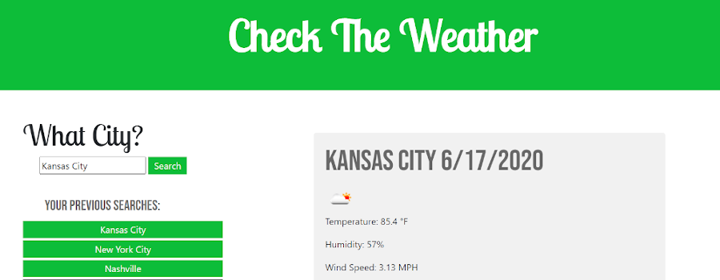

## Weather Dashboard

You can view the deployed application here: https://johnfranke.github.io/Weather-Dashboard/

## Preview



## Description

The user is first prompted with the title of the app (Check The Weather) and then asked to input a city into the search bar. Once the user clicks the search button the current conditions of the city they searched will show on the left (or below if smaller screen). Under that a 5 day forecast for that city will also show. 

When the user searches for a city that city will be stored in localStorage and will prepend to their 'previous searches' list under the search bar. The user can refresh the page and their previous searches will still be in their list. If the user would like to they can clear that list by clicking on the 'Clear History' button below the previous searches.

## User Story

```
AS A traveler
I WANT to see the weather outlook for multiple cities
SO THAT I can plan a trip accordingly
```
```
GIVEN a weather dashboard with form inputs
WHEN I search for a city
THEN I am presented with current and future conditions for that city and that city is added to the search history
WHEN I view current weather conditions for that city
THEN I am presented with the city name, the date, an icon representation of weather conditions, the temperature, the humidity, the wind speed, and the UV index
WHEN I view the UV index
THEN I am presented with a color that indicates whether the conditions are favorable, moderate, or severe
WHEN I view future weather conditions for that city
THEN I am presented with a 5-day forecast that displays the date, an icon representation of weather conditions, the temperature, and the humidity
WHEN I click on a city in the search history
THEN I am again presented with current and future conditions for that city
```
